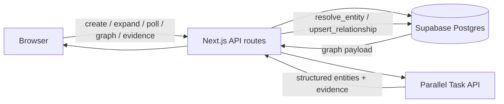

# Entity Graph Explorer

An interactive, evidence-backed entity graph for exploring one-hop relationships
between companies, people, and technologies.

Seed an entity. The app starts a Parallel Task API research run, validates the
structured result, writes it to Supabase Postgres, and renders the neighbourhood
as a force-directed graph. Clicking an unexpanded node researches one more hop.
Identity is resolved only inside the current exploration: the same real-world
thing discovered under different names lands on one node, and one logical
relationship can accumulate multiple source excerpts.

This is a local, single-user MVP. There is no authentication, no shareable
exploration URL, and no deployment path in this repository.

---

## Overview

| | |
| --- | --- |
| App | Next.js 16 App Router + TypeScript |
| Database | Hosted Supabase Postgres |
| Research | Parallel Task API, processor `base` |
| Graph | `react-force-graph-2d` |
| Identity | Deterministic, exploration-scoped |
| Auth | None |

No separate backend service is required. The browser talks only to Next.js
route handlers. Those handlers are the only process that holds
`SUPABASE_SERVICE_ROLE_KEY` and `PARALLEL_API_KEY`.

---

## What the product does

1. Enter an entity name and choose its type (`company`, `person`, or
   `technology`).
2. A placeholder seed node appears immediately in a researching state. The
   create request still waits on Parallel to accept the task (about 1–3
   seconds); the placeholder exists so that wait is not an empty canvas.
3. The server inserts an `explorations` row, resolves the typed name to a seed
   entity, records it as `seed_entity_id`, starts a Parallel run, and inserts a
   `pending` row in `runs`.
4. The page polls `GET /api/runs/:runId` every 2 seconds. On completion that
   endpoint fetches the Parallel result, ingests it, stamps the seed
   `expanded_at`, and closes the run as `complete`.
5. The graph renders the seed, neighbouring entities, and directed relationship
   edges. Clicking an edge lists every supporting excerpt and source URL.
6. Click an unexpanded neighbour to research one more hop from that entity.
   Several expansions can be in flight at once and finish out of order.
7. If later research rediscovers something already present, deterministic
   resolution attaches it to the existing entity instead of creating a second
   node. A variant surface name is stored as an alias.
8. The same relationship from a second source appends evidence to the existing
   edge rather than drawing a second arrow.

Identity is **not** global. Two explorations of "Apple" produce two independent
sets of rows.

---

## Demo / user flow

There is no rehearsed demo sequence in the repo yet (GitHub issue #7 is still
open). A dense, well-connected seed makes the behaviour easiest to inspect
because overlapping discoveries are more likely.

Example:

```text
Seed:  Apple Inc.
Type:  company
```

`scripts/verify-seed-path.ts` defaults to `Anthropic` / `company`.
`scripts/verify-expansion.ts` defaults to `Apple Inc.` / `company` for the same
reason: Apple's immediate neighbours are heavily cross-referenced.

After the first hop, click an **unexpanded** neighbour (ringed node). That
starts one additional one-hop research task. An already-expanded node selects
rather than launching the same research again.

Parallel research is asynchronous. Observed Task API latency for the same
subject ("Stripe") ranged from **31s to 117s** (ADR-0001). The UI keeps the
researching state visible. The server gives up after **5 minutes** and marks
the run `failed`.

Because the source is live web research, the exact neighbourhood is not
identical across runs. The deterministic part of the system begins after
structured rows enter the ingest path.

---

## Reading the graph

Nodes are entities; edges are relationships. Colour is entity type:

- company — blue
- person — amber
- technology — green
- failed research — red

Other visual language:

- The seed is drawn larger than the rest.
- Unexpanded nodes have a dashed ring: there is another hop available.
- A node being researched shows a sweeping arc.
- Edge width grows with the number of evidence rows behind it.
- A node found under more than one name is labelled `·N names` (canonical name
  plus alias count). Selecting it states that it was resolved to this node.
- Arrows follow the relationship predicate, **not** the order in which nodes
  were clicked.

Click a node to select it (and expand it if it has not been researched). Click
an edge to open the evidence panel: the relationship in plain language, then
every excerpt with its source URL as a new-tab link.

---

## Architecture



```text
typed seed
    ↓
placeholder node (client)
    ↓
POST /api/explorations
    → explorations row
    → seed entity via resolve_entity
    → Parallel create (processor "base")
    → pending runs row
    ↓
poll GET /api/runs/:runId every 2s
    → Parallel status
    → GET /v1/tasks/runs/{id}/result   (status never carries the result)
    → ingestRun
         resolve each discovered entity
         canonicalize edge direction
         upsert_relationship + evidence
    → stamp expanded_at, close run as complete
    ↓
GET /api/graph?explorationId=…
    ↓
render in react-force-graph-2d
    ↓
click unexpanded node → POST /api/expand → same poll/ingest loop
```

One Parallel call is **one hop**. Depth is created by the user expanding
nodes. The output schema asks for up to 8 directly related entities.

Ingest happens on the poll GET, not when Parallel finishes. If nothing polls
the run, the upstream task may complete while the local `runs` row stays
`pending`.

### API routes

| Route | Role |
| --- | --- |
| `POST /api/explorations` | `{ query, type }` → `{ explorationId, seedEntityId, runId }` |
| `POST /api/expand` | `{ entityId }` → `{ runId }` or `{ reused: true }` or `{ alreadyExpanded: true }` |
| `GET /api/runs/:runId` | Poll Parallel; on completion, ingest and close the run |
| `GET /api/graph?explorationId=` | Whole exploration as nodes and edges |
| `GET /api/edges/:edgeId/evidence` | Excerpts and source URLs for one relationship |

The browser never talks to Supabase or Parallel directly.

### Intentional omissions

The MVP does **not** use:

| Omitted | Why |
| --- | --- |
| Global canonicalization | Identity is an unsolved problem. Pretending otherwise produces confident-looking wrong merges across explorations. |
| Fuzzy matching | A missed duplicate is preferable to an incorrect merge. |
| Embeddings | Same reason; similarity is not identity. |
| An LLM adjudicator for identity | Adds a second nondeterministic model on top of research. Resolution stays a function of URL, normalized name, type, and alias. |
| A graph database | The graph is small, exploration-scoped, and already a set of relational uniqueness constraints. Postgres is the source of truth; the canvas is a rendering. |
| WebSockets / streaming | Research completion is polled every 2s. Enough for a local demo; keeps the loop inspectable. |
| Auth / multi-user infrastructure | Local single-user demo. Every API route is unauthenticated. |

Also out of scope: Kafka, a vector database, an agent framework, distributed
workers, shareable URLs, re-research of an expanded node, mobile layout, and
deployment.

---

## Data model

Everything is scoped by `exploration_id` and cascades from `explorations`.
`CONTEXT.md` is the vocabulary for these terms.

| Table | Holds |
| --- | --- |
| `explorations` | Seed query and the entity it resolved to |
| `entities` | Canonical name, normalized name, type, optional canonical URL, `expanded_at` |
| `entity_aliases` | Surface names that resolved to an entity and differ from its canonical name |
| `relationships` | Source entity, target entity, predicate |
| `relationship_evidence` | Source URL and verbatim excerpt per relationship |
| `runs` | One research call: upstream run id, `pending` / `complete` / `failed` |

`entity_type` is `company | person | technology`. Type participates in
identity: the same normalized name with two types is two entities.

`predicate` is a closed vocabulary:

```text
founded_by, acquired, works_at, subsidiary_of, built_by,
invested_in, partnered_with, competes_with, uses_technology, related_to
```

Anything the model invents outside that list is coerced to `related_to` rather
than dropped. A type outside the entity vocabulary falls back to `company`.

`entities.description` exists in the schema and `resolve_entity` accepts a
description argument. Nothing currently writes one, and the UI never shows one.

---

## Deduplication strategy

Deduplication is deterministic. Ambiguous matches stay separate.

### Normalization

`lib/normalize.ts` is the single implementation of the comparison keys. The
Postgres function takes already-normalized values as arguments, so the rules
do not exist in SQL.

- **Name:** lowercase, strip diacritics, punctuation, possessives and stacked
  legal suffixes, rejoin acronyms. `Nestlé S.A.` and `Nestle` become `nestle`.
- **URL:** drop scheme, `www.`, trailing slash, query string and fragment.
  Keep host plus path. Unparseable input becomes `null` rather than a junk key.

### Resolution order

`resolve_entity` in `supabase/migrations/0002_resolve.sql`, scoped to one
exploration:

1. Canonical URL exact match (`matched_by_identifier`)
2. Normalized name + type exact match (`matched_by_name`)
3. Alias match, also requiring type to agree (`matched_by_alias`)
4. Insert a new entity (`created`)

Name is checked before alias on purpose: a canonical name is stronger evidence
than a recorded variant.

A surface name is stored as an alias only when it differs from the canonical
name, and never when it would collide with another entity's canonical name.
A canonical URL discovered later is backfilled onto an entity first seen
without one.

If a neighbour's `canonical_url` normalizes to the **subject's** URL, it is
dropped before resolution (`lib/ingest.ts`). Live research has returned the
subject's homepage for unrelated neighbours; taking that URL at face value
absorbed those neighbours into the subject as aliases. A URL equal to the
subject's says nothing about a neighbour. The cost is a missed self-dedup
when the subject reappears under a name that does not normalize to the same
key — the side of the trade this MVP is on.

A row that resolves back onto the subject itself is recorded as a successful
dedup and produces no edge.

### Database-enforced convergence

Application code calls `resolve_entity`, but uniqueness is enforced in
Postgres:

- `unique(exploration_id, normalized_name, type)`
- partial unique `(exploration_id, canonical_url)` where the URL is not null
- `unique(exploration_id, alias_normalized)` so one alias cannot point at two
  entities

Two concurrent expansions that discover the same entity collide on one of
those indexes. The loser catches `unique_violation`, re-reads, and reports
`matched_by_race`. Request timing is not the convergence guarantee.

The ingest-seam tests (`npm run test:db`) cover this against the real
database. Live concurrent expansion against Parallel is implemented but not
closed as verified (issue #5).

---

## Relationship direction semantics

Expanding a node does **not** mean every arrow points outward from that node.

The research prompt asks for `<subject> <predicate> <related entity>`. Edge
direction is then canonicalized in `lib/predicates.ts` so equivalent readings
collapse onto one row:

- **Symmetric** (`partnered_with`, `competes_with`, `related_to`): endpoints
  are ordered by entity id. Both discovery orders produce the same tuple.
- **Type-directed** (`founded_by`, `works_at`, `built_by`, `uses_technology`):
  flipped when the reverse reading matches the type signature and the forward
  one does not.

Example: expanding `Steve Jobs` can correctly persist

```text
Apple Inc.  ── founded_by ──▶  Steve Jobs
```

even though the research call started from Steve Jobs. Expanding Apple later
hits the same `(source, target, predicate)` key and appends evidence.

**Known gap:** `acquired`, `invested_in`, and `subsidiary_of` connect two
companies, so entity types cannot tell which way the model meant. Those
predicates rely on the prompt convention alone. Expanding both ends can still
produce a pair of opposing edges. Fixing that needs a direction field or
inverse predicates. It is designed, not accidental.

---

## Evidence model

A relationship is stored once. Evidence is a child table.

```text
Apple Inc. ── founded_by ──▶ Steve Jobs
                │
                ├── source A + excerpt
                ├── source B + excerpt
                └── source C + excerpt
```

- `upsert_relationship` inserts the logical edge on
  `(exploration_id, source_id, target_id, predicate)`, or finds the existing
  row, then inserts evidence.
- The same source saying the same thing twice is not new evidence:
  `unique(relationship_id, source_url, excerpt)`.
- A discovered row with no `source_url` or excerpt is dropped by the parser
  before ingest. A relationship with no evidence is not stored.
- Excerpts are truncated to 1000 characters on ingest.

`0003_fix_evidence_conflict_ambiguity.sql` is required. The
`upsert_relationship` defined in `0002` is rejected at call time
(`column reference "relationship_id" is ambiguous`) because the function's
OUT column shadows the evidence table column inside PL/pgSQL. Until 0003 is
applied, every run fails on its first evidence insert and the graph never
gains edges.

---

## Parallel integration

`lib/parallel.ts` posts to `https://api.parallel.ai/v1/tasks/runs` with
`processor: "base"` and a JSON output schema.

Verified against live runs (ADR-0001,
`docs/adr/0001-parallel-response-envelope.md`):

- `GET /v1/tasks/runs/{run_id}` returns status only. There is no inline
  `result` at any point in the lifecycle. Fetching
  `GET /v1/tasks/runs/{run_id}/result` is the only path.
- The result envelope is:

```text
{
  run: { …status… },
  output: {
    type: "json",
    basis: [ … ],
    content: { entities: [ … ] }
  }
}
```

- `output.content` arrives as a parsed object. Rows sit at
  `output.content.entities`.
- The parser still walks plausible envelope shapes rather than pinning one,
  because one observed shape does not make the published docs unambiguous. An
  unrecognised envelope yields zero entities, which the app treats as an
  **empty leaf** (the run completed; ingest had nothing to resolve), not a
  failure.
- Parallel returns two `spec_validation_warning`s on every run (it rewrites
  the declared schema to make `canonical_url` required, and rates the task as
  complex for `base`). The app never reads `status.warnings`, so a future
  schema rewrite would land silently.

A sample envelope is committed at
`docs/adr/0001-parallel-envelope-sample.json`.

---

## Local setup

### Prerequisites

- **Node.js 22.6 or newer.** The test suite and `scripts/` gates run under
  `node --experimental-strip-types`, which does not exist in earlier versions.
  `@supabase/supabase-js` also requires Node 22. Developed against **22.13.1**.
- **npm** (comes with Node).
- A **Supabase** project (hosted Postgres). Create one at
  [supabase.com/dashboard](https://supabase.com/dashboard).
- A **Parallel API key** with access to the Task API. Create one at
  [platform.parallel.ai](https://platform.parallel.ai). Every node click
  spends a real research run and costs money.

The Supabase CLI is not required and is not configured in this repo (there is
no `supabase/config.toml`).

### 1. Clone and install

```bash
git clone https://github.com/annamariadominic/entity-explorer.git
cd entity-explorer
npm install
```

### 2. Credentials

There is no committed `.env.example`. `.gitignore` matches `.env*`, so create
`.env.local` in the repository root by hand:

```bash
NEXT_PUBLIC_SUPABASE_URL=https://<project-ref>.supabase.co
SUPABASE_SERVICE_ROLE_KEY=<secret or service_role key>
PARALLEL_API_KEY=<parallel api key>
```

Those three are the only variables the application reads
(`lib/supabase.ts`, `lib/parallel.ts`).

| Variable | Where to get it | Who may see it |
| --- | --- | --- |
| `NEXT_PUBLIC_SUPABASE_URL` | Supabase Dashboard → **Settings → API Keys** (Project URL). Also visible in the Connect dialog. | Public. It identifies the project; it is not a secret. Prefixed `NEXT_PUBLIC_` because Next.js exposes that prefix to the browser bundle, but no client module currently imports it. |
| `SUPABASE_SERVICE_ROLE_KEY` | Same page. On current projects this is the **secret** key (`sb_secret_…`). Older projects still show the legacy `service_role` JWT. Either works with `createClient`. Reveal it before copying. | **Server only.** Bypasses row-level security (RLS is not enabled anyway). Never prefix this `NEXT_PUBLIC_`. Never import `lib/supabase.ts` from a client component. |
| `PARALLEL_API_KEY` | [platform.parallel.ai](https://platform.parallel.ai) → create an API key. | **Server only.** Sent as `x-api-key` from route handlers. |

Do not commit `.env.local`. Do not paste these values into client components,
README snippets, or tickets.

Two further names you may see:

- `NEXT_PUBLIC_SUPABASE_ANON_KEY` / a publishable `sb_publishable_…` key —
  present in some local env files, **not read by anything in this repo**. The
  browser never talks to Supabase. You do not need to set it.
- `BASE_URL` — optional, read only by `scripts/verify-seed-path.ts` and
  `scripts/verify-expansion.ts`. Defaults to `http://localhost:3000`.

---

## Supabase migration setup

Apply the three files **in filename order**. Do not skip 0003.

| File | What it creates |
| --- | --- |
| `supabase/migrations/0001_init.sql` | Enums, tables, uniqueness indexes |
| `supabase/migrations/0002_resolve.sql` | `resolve_entity`, plus a first `upsert_relationship` that **cannot execute** |
| `supabase/migrations/0003_fix_evidence_conflict_ambiguity.sql` | Working `upsert_relationship` |

The reliable path is the Supabase Dashboard **SQL Editor**: open each file,
paste its contents, run, then move to the next. `psql` against the project's
connection string also works.

`supabase db push` is not set up. There is no `supabase/config.toml`, so that
route additionally needs `supabase init` and
`supabase link --project-ref <ref>` first. That is optional and untested here.

The migrations are **not idempotent**. They use bare `create type` /
`create table`. Re-running 0001 against a database that already has the schema
will error.

### Confirm the schema landed

Run `supabase/verify-schema.sql` in the SQL Editor. It lists every table,
enum, function and unique index the app depends on. **Every row must report
`ok = true`.** A partially applied migration otherwise shows up later as an
opaque runtime error.

Expected: six tables, three enums (`entity_type`, `predicate`, `run_status`),
two functions (`resolve_entity`, `upsert_relationship`), five unique indexes.

---

## Running the app

```bash
npm run dev
```

Open [http://localhost:3000](http://localhost:3000). Type a seed, pick its
type, press **Explore**.

| Command | What it does |
| --- | --- |
| `npm run dev` | Next.js dev server, port 3000 |
| `npm run build` | Production build |
| `npm start` | Serve the production build (after `build`) |
| `npm test` | Pure-function tests: normalization and edge canonicalization. 9 tests, no network, no database. |
| `npm run test:db` | Ingest-seam tests against the hosted Supabase project. Skips if env vars are missing. |
| `npm run lint` | ESLint. Currently **fails** — see Known limitations. |

`npx tsc --noEmit` and `npm run build` both pass.

---

## Tests / verification commands

Automated tests cover two seams. Live Parallel is exercised by manual scripts,
not fixtures: a recorded fixture would only prove that the fixture agrees with
the parser.

### Always-safe

```bash
npm test
npx tsc --noEmit
```

### Against the hosted database

Needs `.env.local` with Supabase credentials. Each test creates its own
exploration and deletes it afterwards (every table cascades from that row).

```bash
npm run test:db
```

Covers: variant names resolving to one entity, a self-referencing row
producing no edge, evidence accumulating across sources, an identical row
ingested twice adding no second evidence row, concurrent ingest converging on
one row, distinct entities staying distinct, and a neighbour handed the
subject's URL not resolving onto the subject.

### Live Parallel gates

Each issues at least one real Task API run and costs money. The dev server
must be running for the last two.

```bash
# Confirms the real Parallel envelope still parses, and compares rows the
# API returned against rows the parser kept. Writes parallel-envelope.json
# (gitignored).
node --env-file=.env.local --experimental-strip-types \
  scripts/verify-parallel-envelope.ts

# Drives POST /api/explorations and the run poll, then checks what landed
# in the database rather than trusting the rendering. Needs `npm run dev`.
node --env-file=.env.local --experimental-strip-types \
  scripts/verify-seed-path.ts [seed name] [company|person|technology]

# Expansion, alias/dedup visibility, and two concurrent neighbour expansions.
# Needs `npm run dev`. Costs three research runs. Live research is
# nondeterministic, so a sparse neighbourhood can fail the overlap checks
# without the rules being wrong.
node --env-file=.env.local --experimental-strip-types \
  scripts/verify-expansion.ts [seed name] [company|person|technology]
```

### What has actually been verified

GitHub issues, parent #1:

| Issue | State | What that means |
| --- | --- | --- |
| #2 Configure credentials and apply migrations | Closed | Hosted project was brought up; schema confirmed. There are now **three** migrations, not the two the ticket originally named. |
| #3 Verify the Parallel response envelope | Closed | Live envelope documented in ADR-0001. Repeatable via `verify-parallel-envelope.ts`. |
| #4 Verify seed → research → ingest → graph | Closed | End-to-end against live Parallel and Supabase. Repeatable via `verify-seed-path.ts`. |
| #5 Verify expansion, deduplication, concurrent convergence | **Open** | Implementation and ingest-seam tests exist. The live expansion walkthrough against Parallel is not closed. |
| #6 Verify evidence panel and failure states | **Open** | The UI for evidence, empty leaves, failed nodes, retry, and the 5-minute ceiling is implemented. It has not been walked as a verification ticket. |
| #7 Demo rehearsal and blocker fixes | **Open** | No rehearsed seed sequence is recorded. |

Do not treat expansion, evidence-panel edge cases, or failure-state behaviour
as proven just because the code paths exist.

---

## Known limitations

### Research latency

Parallel Task API calls are not instantaneous. ADR-0001 measured 31s, 80s and
117s on the same subject. The UI exposes the researching state. The poll
ceiling is 5 minutes; a run older than that is marked `failed`.

There is no caching, no rate limiting, and no cost ceiling. Every node click
spends a real run.

### Deterministic matching misses some true duplicates

Two names a human recognizes as the same real-world entity stay separate if
no canonical URL, alias, or normalized-name/type match exists. That is the
precision-over-recall trade this MVP chose. Do not add fuzzy or model-based
resolution to close it.

### Same-type directional relationships can be ambiguous

`acquired`, `invested_in`, and `subsidiary_of` cannot be oriented from entity
types. Expanding both ends can produce opposing edges.

### Exploration-local identity only

Nothing is shared across explorations. There is no global entity registry.

### No authentication / multi-user model

Migrations do not enable RLS. The app uses the service role key. Every API
route is unauthenticated: anyone who can reach the app can create
explorations, and anyone holding an exploration id can read it via
`GET /api/graph`. This is a local demo, not something to deploy publicly.

### No streaming or WebSockets

Research completion is polled. Ingest is triggered by that poll GET (a write
on a GET request — acceptable for the demo, not an oversight).

### Live research is nondeterministic

The same seed can return 3–8 entities with different names and predicates on
different days. Dedup that depends on overlapping live results may not fire
in a given run.

### Graph and product gaps

- The exploration id lives in client state only. A refresh loses the graph;
  the rows remain in Supabase, but there is no UI to list or reopen a past
  exploration.
- Research is one hop and capped at 8 entities per run.
- An empty leaf is a completed run whose ingest produced zero resolution
  reports (the parser kept no rows). It is labelled in the side panel as
  "No relationships found." That is distinct from a failure. Implemented,
  not ticket-verified. A run that only rediscovers the subject itself is
  *not* flagged empty: ingest still reports those rows, and no new edge is
  drawn.
- Failed nodes turn red and offer Retry. Same status: implemented, not
  ticket-verified.
- A nonsense seed has no special-case explanation. If Parallel returns
  nothing, it presents as an empty leaf; if it returns a neighbourhood, that
  neighbourhood is shown.
- Credential and upstream errors on seed creation surface as a banner. Errors
  on an in-flight run surface on the failed node. Issue #6 is still the
  verification ticket for these states.
- `GET /api/graph` now loads evidence by the exploration's relationship ids
  (the unbounded query named in issue #6 is fixed). A single exploration with
  more than PostgREST's default row cap (1000) of evidence rows could still
  under-count. That is a remaining cap, not the original bug.
- Parallel `spec_validation_warning`s are ignored.
- `npm run lint` fails with 6 `@typescript-eslint/no-explicit-any` errors in
  `components/GraphCanvas.tsx`, where the force-graph callbacks are untyped.
- No deployment configuration exists in this repository.

---

## Troubleshooting

### The seed appears but no edges ever arrive

Check the research run state and the Next.js server log first.

Confirm **all three** SQL migrations were applied in order. If only 0001 and
0002 are applied, ingest fails on every run with
`column reference "relationship_id" is ambiguous` and no relationship or
evidence row is written.

Re-run `supabase/verify-schema.sql` and check that `upsert_relationship`
exists. Existence of the function is not enough if 0003 was skipped — 0002
already created a function of that name that cannot execute. Re-run 0003.

### Research appears stuck

Live Task API calls often take more than a minute. The app waits 5 minutes
before failing the run. Watch the server log and the `runs` row before
assuming the browser is frozen.

If the tab was closed, nothing is polling, so ingest will not run until
something hits `GET /api/runs/:runId` again.

### Missing-credential errors on Explore

The create route throws if `.env.local` lacks `NEXT_PUBLIC_SUPABASE_URL`,
`SUPABASE_SERVICE_ROLE_KEY`, or `PARALLEL_API_KEY`. Restart `npm run dev`
after editing `.env.local` so Next.js reloads the values.

### The graph contains what looks like a duplicate

Check whether the two nodes actually satisfy a resolution tier (same
normalized URL, or same normalized name and type, or a stored alias). The
application will not merge on approximate similarity.

### An arrow appears to point "backwards"

Traversal direction is not edge direction. Expanding `Steve Jobs` can
correctly produce `Apple Inc. → Steve Jobs` for `founded_by`.

### `npm run lint` fails

Expected. Six `no-explicit-any` errors in `components/GraphCanvas.tsx`. Use
`npm test` and `npx tsc --noEmit` as the local checks.

### `npm test` warns about type stripping / module type

Expected on Node 22. The suite still passes. There is no `"type": "module"`
in `package.json`.

---

## Project structure

```text
app/
  page.tsx                          UI: form, polling, side panel
  layout.tsx                        root layout
  api/explorations/route.ts         POST — create exploration, resolve seed, start run
  api/expand/route.ts               POST — start a run for an existing entity
  api/runs/[runId]/route.ts         GET  — poll, ingest on completion, close the run
  api/graph/route.ts                GET  — exploration as nodes and edges
  api/edges/[edgeId]/evidence/      GET  — excerpts and source URLs for one edge

components/GraphCanvas.tsx          force-directed canvas (react-force-graph-2d)

lib/
  normalize.ts                      the single implementation of the dedup keys
  predicates.ts                     predicate vocabulary, coercion, edge direction
  parallel.ts                       Task API client and envelope parsing
  ingest.ts                         research rows → resolved entities and edges
  supabase.ts                       service-role client, server-only
  types.ts                          shared types
  __tests__/dedup.test.ts           pure-function tests (npm test)
  __tests__/db/ingest.test.ts       ingest-seam tests (npm run test:db)

supabase/
  migrations/                       0001, 0002, 0003 — apply in order
  verify-schema.sql                 catalog check after migrating

scripts/
  verify-parallel-envelope.ts       live envelope gate
  verify-seed-path.ts               live seed-path gate
  verify-expansion.ts               live expansion / dedup gate

docs/adr/                           ADR-0001 and the sample envelope
CONTEXT.md                          domain vocabulary
```

The architectural boundary is small on purpose:

```text
browser
  → Next.js API
    → research + ingest
      → Supabase Postgres
```

The hard part of this MVP is not infrastructure volume. It is keeping
semantics trustworthy while live research incrementally mutates an interactive
graph: identity must converge deterministically, evidence must survive
deduplication, repeated relationships must not become duplicate edges,
asynchronous expansions must attach to the correct exploration, and graph
direction must represent the claim rather than the user's click path.
